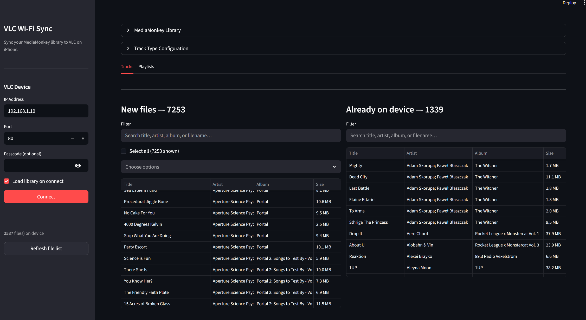
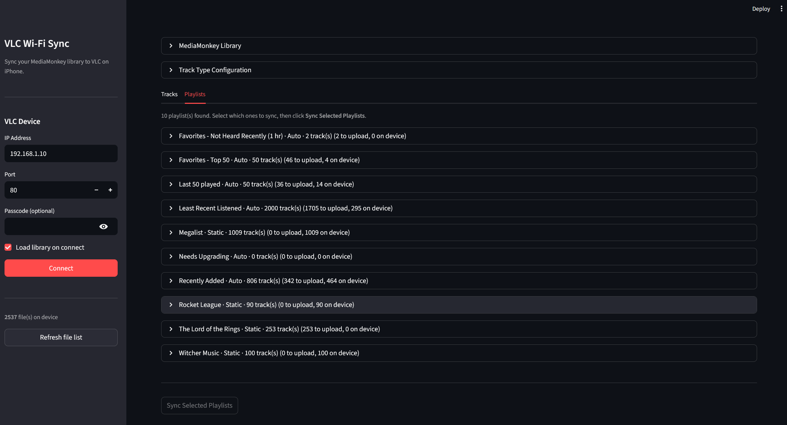

# vlc-mobile-librarian

A local Streamlit app for syncing music from your PC to [VLC for iPhone](https://apps.apple.com/us/app/vlc-for-mobile/id650377962) via its built-in **[Sharing via Wi-Fi](https://docs.videolan.me/vlc-user/ios/3.X/en/gettingstarted/media_synchronization.html?highlight=wifi#share-via-wi-fi)** feature.

VLC's browser upload has no duplicate detection and no library management. This app reads your [MediaMonkey](https://www.mediamonkey.com/) library database, diffs it against what's already on the device, and lets you upload only the new files - with per-file progress bars.

**Note:** This is very much a "vibe-coded" app. I worked on this over a couple evenings trying to solve a, very specific and annoying, problem that I had. My primary home machine is a Windows PC with MediaMonkey, I have an iPhone, and I don't want to use Apple Music or iTunes. The VLC iOS app is pretty great and its Share over WiFi feature while handy, lacked the complexity I needed for my large music library.

## Screenshots

**Tracks view** - in-library files with filters and the already-on-device list:



**Playlists view** - sync by playlist, with per-playlist upload counts:



## Requirements

- Python 3.13+
- [uv](https://docs.astral.sh/uv/)
- [MediaMonkey 5](https://www.mediamonkey.com/) (Windows) with a populated library
- VLC for iPhone with **Sharing via Wi-Fi** enabled (Settings → Wi-Fi Sharing)
- Your PC and iPhone on the same Wi-Fi network
- Running on Windows natively, or inside WSL2 (with Windows drives mounted at `/mnt/c`, `/mnt/d`, etc.)

## Setup

```bash
uv sync
```

## Docker

If you'd prefer not to install Python and uv locally, you can run the app with Docker.

### Quick start

```bash
docker compose up --build
```

Then open [http://localhost:8501](http://localhost:8501) in your browser.

### Mounting your music library

The app reads audio files directly from your filesystem to upload them to VLC. MediaMonkey stores file paths as Windows drive-letter paths (e.g. `D:\Music\...`), which the app resolves to `/mnt/d/Music/...` on Linux. You need to mount your Windows drives into the container at the same paths so uploads work.

Uncomment and adjust the drive mount lines in `docker-compose.yaml`:

```yaml
volumes:
  - /mnt/c:/mnt/c:ro
  - /mnt/d:/mnt/d:ro
```

Add a line for each drive letter that contains music files.

### MediaMonkey DB path

If your C: drive is mounted at `/mnt/c`, the app auto-detects the MediaMonkey database at the standard AppData location. If your database is on a different drive or path, set `MM_DB_PATH` in `docker-compose.yaml`:

```yaml
environment:
  MM_DB_PATH: /mnt/d/Users/YourName/AppData/Roaming/MediaMonkey5/MM5.DB
```

### Persistent settings

A named Docker volume (`app-config`) stores your VLC connection settings and track-type configuration between container restarts, so you don't need to re-enter them each time.

## Usage

```bash
uv run streamlit run src/vlc_mobile_librarian/app.py
```

Then open [http://localhost:8501](http://localhost:8501) in your browser.

### Workflow

1. **Connect** - In the sidebar, enter the IP address shown in VLC (Settings → Wi-Fi Sharing), port (default: 80), and passcode if you have one set. Click **Connect**.

2. **Load library** - The MediaMonkey database is auto-detected from the standard AppData location (on Windows or WSL2). Confirm the path and click **Load**.

3. **Select** - Two columns appear:
   - **In Library** - tracks in MediaMonkey not yet on the device. Filter by title, artist, album, or filename. Use the checkbox to select all shown, or pick individually.
   - **Already on device** - tracks that match by filename; these are skipped.

4. **Upload** - Click the upload button. Per-file progress bars animate in real time. Uploads continue even if individual files fail.

5. **Refresh** - After uploading, click **Clear & refresh** to re-diff against the updated device library.

## Notes

- **Custom DB path** - set the `MM_DB_PATH` environment variable to skip auto-discovery and use a specific database file:
  ```bash
  MM_DB_PATH="/mnt/d/Users/me/AppData/Roaming/MediaMonkey5/MM5.DB" uv run streamlit run src/vlc_mobile_librarian/app.py
  ```
- **Duplicate detection** is by filename only (case-sensitive). `Song.mp3` and `song.mp3` are treated as different files.
- **No delete support** - VLC's Wi-Fi sharing API has no delete endpoint. Remove files from within the VLC app on your phone.
- The library is cached per DB path; click **Load** again to pick up changes made in MediaMonkey since the last load.
- Only local audio tracks (`TrackType = 0`) from local drives are included. Podcasts, videos, and network sources are excluded.

## Adding other library sources

The app is (loosely) built around a plugin interface, so support for other music library managers (MusicBee, iTunes/Music.app, foobar2000, a plain folder scan, etc.) is a plausible future addition.

To add a new source:

1. **Create `src/vlc_mobile_librarian/sources/<name>.py`** and implement the `LibrarySource` abstract base class. The required surface is:
   - `name` - a class-level string shown in the UI
   - `config_fields()` - returns the list of `ConfigField` objects the app renders as a generic setup form (paths, credentials, etc.)
   - `from_settings(config)` - constructs an instance from the filled-in config dict
   - `is_available()` - cheap check that the source is reachable
   - `discover_categories()` - returns groupings the user can filter by (return `[]` if not applicable)
   - `scan_library(categories)` / `scan_playlists(categories)` - return `list[LocalFile]` / `list[Playlist]`

2. **Register the class in `AVAILABLE_SOURCES`** in [sources/\_\_init\_\_.py](src/vlc_mobile_librarian/sources/__init__.py):
   ```python
   AVAILABLE_SOURCES: list[type[LibrarySource]] = [
       MediaMonkeySource,
       YourNewSource,   # add it here
   ]
   ```

That's the only change needed outside the new file - `app.py` discovers sources entirely through `AVAILABLE_SOURCES` and renders their config forms generically.
